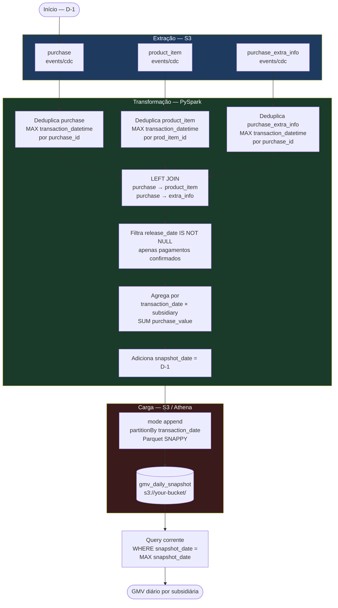

# Fluxo do ETL — GMV Diário por Subsidiária

## Garantias da modelagem

| Requisito | Como é atendido |
|---|---|
| Imutabilidade | `mode("append")` — histórico nunca é sobrescrito |
| Idempotência | Deduplicação por `MAX(transaction_datetime)` antes do join |
| Navegação temporal | Cada execução grava um `snapshot_date` distinto |
| Registros correntes | `WHERE snapshot_date = MAX(snapshot_date)` |
| Assincronismo entre tabelas | `LEFT JOIN` preserva compras com eventos pendentes |
| Particionamento | `partitionBy("transaction_date")` — partition pruning no Athena |
