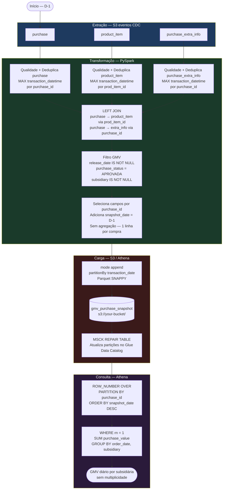

# Fluxo do ETL — Snapshot Histórico de GMV por Compra

## Por que a tabela não é agregada

A tabela final armazena **uma linha por compra por snapshot**, não o GMV já somado.

Isso é necessário porque:

- A mesma compra pode ser **corrigida retroativamente** (valor, subsidiária, status).
- Um `SELECT + SUM` direto sobre a tabela histórica traria **multiplicidade** — a mesma `purchase_id` somada N vezes.
- A navegação temporal exige saber o estado de cada `purchase_id` **em um ponto específico no tempo**, o que só é possível com granularidade por compra.

A agregação ocorre **na query**, após identificar o registro mais recente de cada `purchase_id` via `ROW_NUMBER`.

## Garantias da modelagem

| Requisito | Como é atendido |
|---|---|
| Imutabilidade | `mode("append")` — histórico nunca é sobrescrito |
| Idempotência | Deduplicação por `MAX(transaction_datetime)` antes do join |
| Rastreabilidade diária | Granularidade `snapshot_date × purchase_id` |
| Navegação temporal | Filtrar `snapshot_date <= data_referencia` + `ROW_NUMBER` |
| Registros correntes | `ROW_NUMBER` por `purchase_id` ordenado por `snapshot_date DESC` |
| Assincronismo entre tabelas | `LEFT JOIN` preserva compras com eventos ainda pendentes |
| Particionamento | `partitionBy("transaction_date")` — partition pruning no Athena |
| Sem multiplicidade na query | `ROW_NUMBER` antes do `SUM` — estado mais recente por compra |
